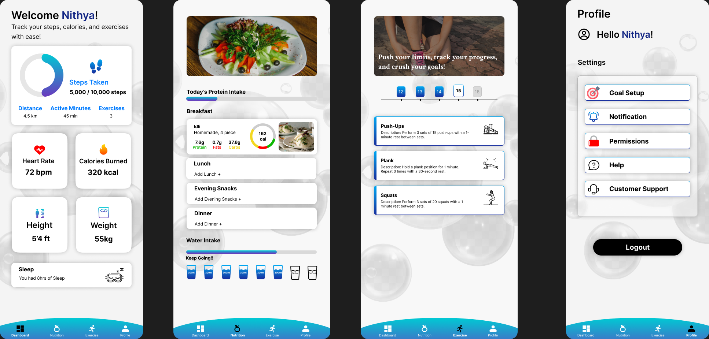

# NandanaMundakad-NandanaMundakad-UI-UX-task-3
### Mobile App UI/UX Redesign

This repository contains the redesigned layout and components for a mobile application. The goal of this redesign is to enhance user experience, improve visual aesthetics, and ensure responsiveness across all devices.

---

## 🖼 Project Preview

---

## 🔧 Project Overview

**Project Type:** Mobile App UI/UX Redesign  
**Tools Used:** Figma (Design, Wireframes, Prototyping)  

---

## ✨ Key Features

### Visual Aesthetics
- **Design Style:** Clean and minimalistic design with blue and white gradients for a calming and fresh feel.
- **Modern Elements:** Use of rounded icons and cards for an approachable look.
- **Typography:** High-contrast typography ensuring readability for all user demographics.

### Improved Navigation
- **Bottom Navigation Bar:** Structured for quick access to key sections:
  - **Dashboard:** Overview of activity, sleep, steps, and calories.
  - **Nutrition:** Daily meal tracker with calorie breakdown and water intake progress.
  - **Exercise:** Personalized workout routines, descriptions, and progress tracking.
  - **Profile:** Settings, notifications, goal setup, and user support.

### Responsive Design
- **Device Optimization:** Layouts optimized for smooth performance on smartphones and tablets.
- **User Experience:** Seamless transitions between tabs for a better experience.
- **Interactive Elements:** Sliders for step goals and water intake tracking.

### Accessibility Compliance
- **Assistive Features:** Descriptive icons and alt-text for all visual elements.
- **Usability:** Large touch targets and clear call-to-action buttons.

### User-Centric Features
- **Goal Progress:** Real-time updates on fitness goals like steps, active minutes, and exercises.
- **Health Insights:** Visual breakdowns of heart rate, calories burned, and sleep analysis.
- **Gamification Elements:** Motivational messages and progress visuals to encourage consistency.

---

## 📂 Dedicated Sections

### Dashboard Overview
- Metrics: Steps, calories burned, heart rate, sleep, and body stats (height/weight).
- Progress Visuals: Engaging progress rings for quick performance tracking.

### Nutrition Module
- Tracking: Monitor protein, fats, and carbs intake for each meal with calorie counts.
- Hydration: Gamified water intake tracker with a "Keep Going!" progress bar.

### Exercise Section
- Workouts: Personalized workout plans with descriptions and illustrations.
- Categories: Exercises such as Push-Ups, Plank, Squats, and more.
- Calendar: Progress calendar for consistency tracking.

### Profile Settings
- Customization: Goal setup for steps, nutrition, and workouts.
- Notifications: Permission management for timely reminders.
- Support: Easy access to Help and Customer Support.
